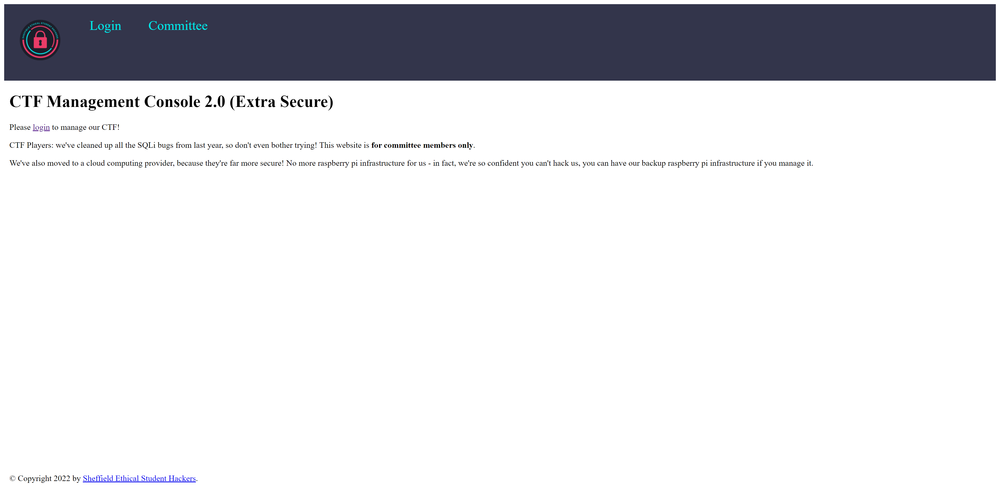
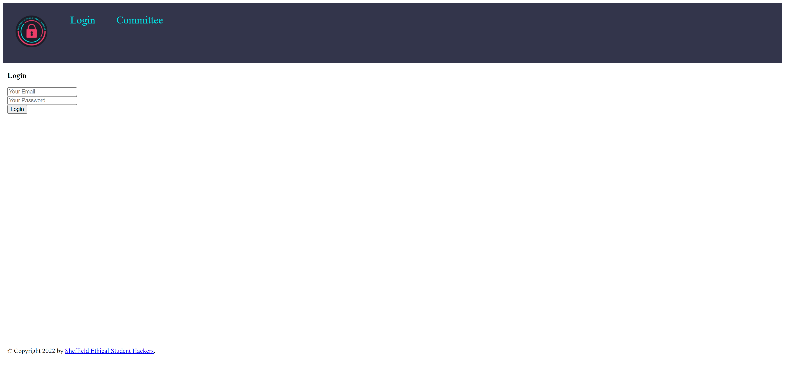
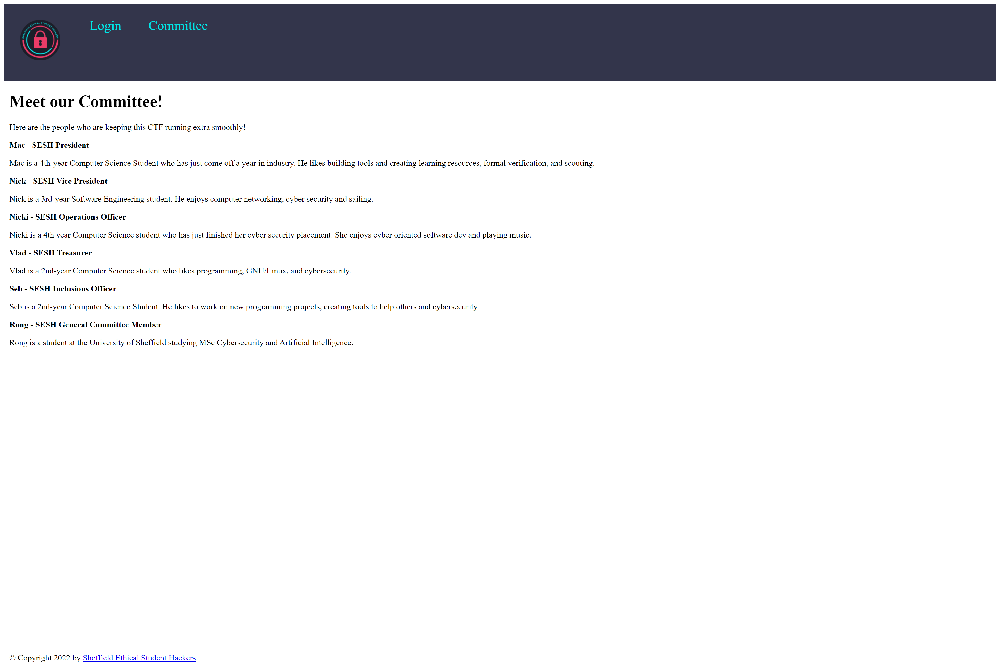

# Heist Part 2: Bad Hygiene
> 100pts

## Breifing
Can you exploit the committee themselves to gain access to their admin page?

## Hint
Think back to our Social Engineering sessions - are there are any personal details about the committee that have been exposed that you could use to make some guesses at their passwords?

## Solution
Unfourtnatly taking the L on the hint was useless to us as I am not a University of Sheffield student!

If we visit `35.178.187.4`, we can see the following:



`/login` looks something a bit like this:



And `/committee` looks a bit like this:



Viewing the source of `/committee` provides the following hint:

```html
<!-- @committee/admins - we have set you up an account each with <your name in lowercase>@ctf.shefesh.com as your username, and a default password
remember to change your password in the database after you've logged in and tried out the system!
(but please don't make it something super obvious... remember, we taught our members social engineering after all) -->
```

Therefore the usernames are going to be one of the following:

```
mac@ctf.shefesh.com
nick@ctf.shefesh.com
nicki@ctf.shefesh.com
vlad@ctf.shefesh.com
seb@ctf.shefesh.com
rong@ctf.shefesh.com
```

## Flag
Flag: `SESH{}`