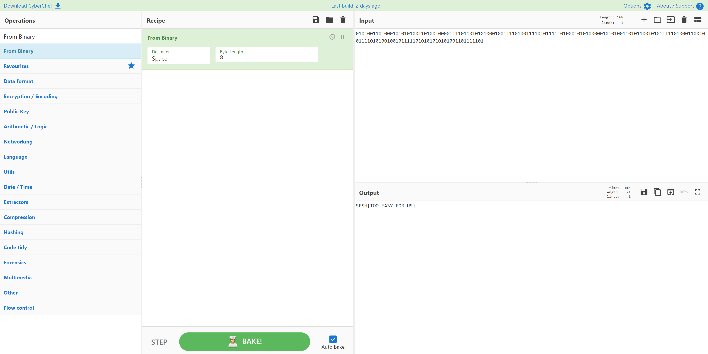

# 2 Attempts
> 50pts

## Breifing
Unfortunately, it took the attackers only 2 attempts to break into the online grocery store. As its security was rather weak, they took their time to taunt the owners in one of the text files.

"010100110100010101010011010010000111101101010100010011110100111101011111010001010100000101010011010110010101111101000110010011110101001001011111010101010101001101111101"

## Solution
[CyberChef](https://gchq.github.io/CyberChef/#recipe=From_Binary('Space',8)&input=MDEwMTAwMTEwMTAwMDEwMTAxMDEwMDExMDEwMDEwMDAwMTExMTAxMTAxMDEwMTAwMDEwMDExMTEwMTAwMTExMTAxMDExMTExMDEwMDAxMDEwMTAwMDAwMTAxMDEwMDExMDEwMTEwMDEwMTAxMTExMTAxMDAwMTEwMDEwMDExMTEwMTAxMDAxMDAxMDExMTExMDEwMTAxMDEwMTAxMDAxMTAxMTExMTAx) makes light work of this challenge:

## Flag
Flag: `SESH{TOO_EASY_FOR_US}`