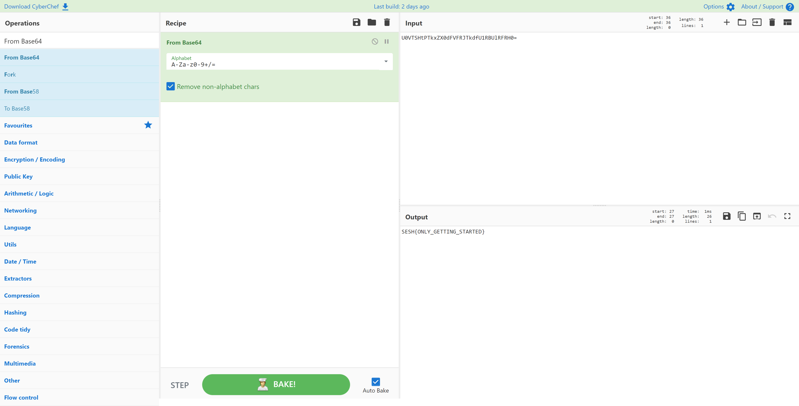

# 64 Raspberries
> 50pts

## Breifing
Having gained access to the system, the cybercriminals started deleting the grocery entries from the store and the remaining 64 raspberries, which were in high demand at the time, will no longer be delivered to the customers.

They left an encoded message to the owners.

"U0VTSHtPTkxZX0dFVFRJTkdfU1RBUlRFRH0="

## Solution
[CyberChef](https://gchq.github.io/CyberChef/#recipe=From_Base64('A-Za-z0-9%2B/%3D',true)&input=VTBWVFNIdFBUa3haWDBkRlZGUkpUa2RmVTFSQlVsUkZSSDA9) makes light work of this challenge:

## Flag
Flag: `SESH{ONLY_GETTING_STARTED}`