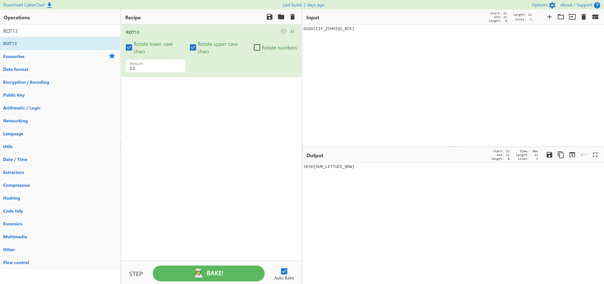

# Caesar Salad
> 50pts

## Breifing
The lettuce the grocery store used to sell was widely used to prepare delicious Caesar salads, as its quality and price were unmatched in the market.

Naturally, the attackers discovered its value and removed it from the store, celebrating their victory.

"GSGV{CIF_ZSHHIQS_BCK}"

## Solution
[CyberChef](https://gchq.github.io/CyberChef/#recipe=ROT13(true,true,false,12)&input=R1NHVntDSUZfWlNISElRU19CQ0t9) makes light work of this challenge:

## Flag
Flag: `SESH{OUR_LETTUCE_NOW}`