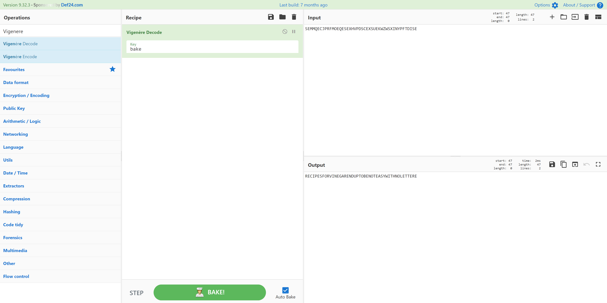

# Vinegar
> 200pts

## Breifing
A past frESH Groceries employee has let his vinegar recipe ferment and go bad - can you decrypt it?

Flag format: SESH{Decrypted Text}

Author: Mac

## Solution
The provided file can be found [here](vinegar.txt).

[CyberChef](https://cyberchef.org/#recipe=Vigen%C3%A8re_Decode('bake')&input=U0VNTVFFQ0pQUkZNT0VRRVNFWEhWUERTQ0VYU1VFS1daV1NYSU5ZUEZURElTRQo) makes light work of this challenge:

## Flag
Flag: `SESH{RECIPESFORVINEGARENDUPTOBENOTEASYWITHNOLETTERE}`