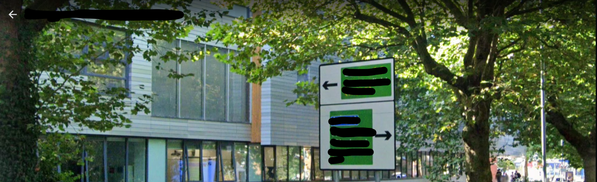

# Geographically Exposed
> 100pts

## Breifing
One of the owners of the grocery store, who is known to be friendly and inclusive, woke up to a changed profile picture on his account which was showing a road sign on the street where the sixth form college he attended before University is located.

The street sign was split into two unequal parts. The top part had an arrow pointing left, some location names, letters, and numbers.

What is the 3-digit number on that street sign?

*format: SESH{number}

## Solution
At first an image wasn't provided for this challenge, making it slight guesswork and a lot of walking around Google Maps.

Working off of the other OSINT challenge, we know Mac went to Aquinas College (Stockport).

This allowed for us to find a sign matching this description on [Google Maps](https://www.google.com/maps/@53.3965932,-2.1472807,3a,77.8y,241.7h,78.95t/data=!3m6!1e1!3m4!1s0b_7Z5YMpnimxNiDIcDObQ!2e0!7i16384!8i8192):

This was verified by the image provided a few hours into the CTF:

## Flag
Flag: `SESH{523}`