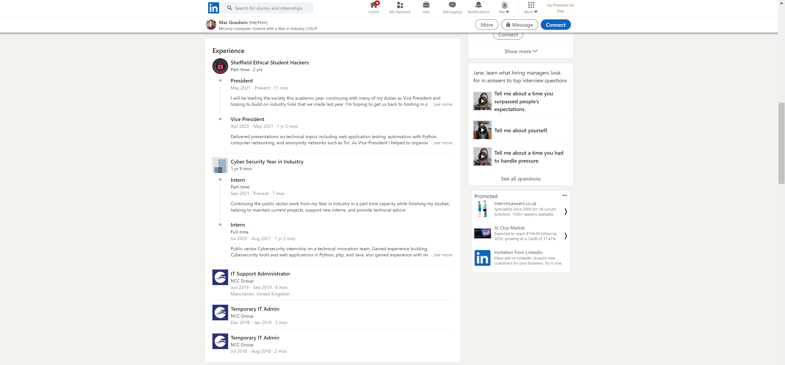

# Open Source *Intelligence*
> 150pts

## Breifing
The attackers have built profiles about the owners of the grocery store by making use of publicly available information.

They discovered that one of them was an intelligent student that had an influential position in the store, and that drew their attention.

When the student logged into their personal account of the grocery store, they realised that their username had been changed to contain their best mark for a module at University (number without %), their place of birth (all lowercase letters) and what they worked as full-time from July 2020 to August 2021 (all lowercase letters).

What did the student see?

*format: SESH{mark_place_position}

## Solution
This challenge is effectively broken down into 3 parts:

### Mark
Looking at [Mac's Blog](https://www.mac-goodwin.com/compsci/#techs-and-interests), we can see he achieved 99% in his functional programming module.

### Place
Looking at [Mac's Twitter](https://twitter.com/mac__goodwin), we can see his location is set to `Manchester`:

This matches Mac's LinkedIn regarding the location of work experience at NCC.

### Position
On [LinkedIn](https://www.linkedin.com/in/mac-goodwin/) we can see Mac worked as an `Intern` within the public sector:

## Flag
Flag: `SESH{99_manchester_intern}`
