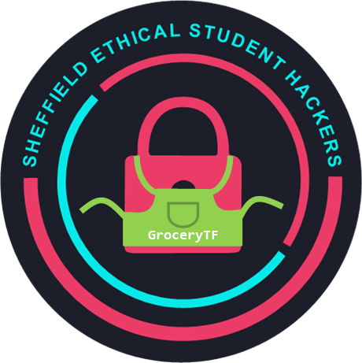

# Sheffield Ethical Hackers Society GroceryTF CTF 2022
Thurs 31st March 12:00 BST - Sat 2nd April 17:00 BST

> Guess who's back, back again

## Registration
* Register on [GroceryTF](https://ctf.shefesh.com/) using a university email.

## Leaderboard 
* [GroceryTF Leaderboard](https://ctf.shefesh.com/scoreboard)

## Challenge Writeups
These have been organized in order they appear on the site:

### Cryptography
| 50pts | 100pts | 150pts | 200pts | 250pts |
| ----- | ------ | ------ | ------ | ------ |
| [64 Raspberries](Cryptography/64%20Raspberries) | Tapped Into System | John's Birthday #3 | Vinegar | Requirements Secretly Analysed |
| [2 Attempts](Cryptography/2%20Attempts) | John's Birthday #2 | | Tyger Tyger, Burning Bright |
| [Caesar Salad](Cryptography/Caesar%20Salad) |
| [John's Birthday #1](Cryptography/John's%20birthday%20%231) | 

### OSINT
| 150pts | 
| ------ |
| [Open Source Intelligence](OSINT/Open%20Source%20Intelligence) |

### Web
| 50pts | 110pts | 150pts |
| ----- | ------ | ------ |
| Robotic | Closing Time | Cache Me Outside |

### GEOINT
| 100pts |
| ------ |
| [Geographically Exposed](GEOINT/Geographically%20Exposed) |

### Forensics
| 100pts |
| ------ |
| [Private Investigitter Part 1 - Bad Habits](Forensics/Private%20Investigitter%20Part%201%20-%20Bad%20Habits) |
| Private Investigitter Part 2 - Unfocused |
| Private Investigitter Part 3 - Cloudy with a Chance of Secrets |
| Private Investigitter Part 4 - Not Even Remotely Secure |

### Miscellaneous
| 25pts |
| ----- |
| [Easy Peasy](Miscellaneous/Easy%20Peasy) |
| [Read the Rules](Miscellaneous/Read%20the%20Rules) |

### Steganography
| 65pts |
| ----- |
| A Strange Caterpillar Message |

### Boot2Root
| 50pts | 100pts |
| ----- | ------ |
| [Heist Part 1 - Where's our Console](Boot2Root/Heist%20Part%201%20-%20Where's%20our%20Console) | Heist Part 2 - Bad Hygiene |

## Event Info & Code of Conduct
### Event Info
After a disaster last year, the SESH Bakery has improved their security practices (slightly) and made an ambitious expansion to a full-blown grocery store - frESH Groceries!

However, they still have some leaks to plug! Their employees have bunked off the mandatory awareness training, and their web developers are still making sloppy mistakes (which will teach frESH not to use UoS Software Hut students for cheap labour...).

Can you help them identify the holes in their infrastructure and various websites to prevent a full-blown cyber attack occurring again?

There's also a side quest: the SESH committee has also made some improvements to their CTF infrastructure after their Raspberry Pi got stolen last year! Can you find your way into their CTF Management Panel again, and even discover some adjacent systems that they'd really rather not be found?

SESH{EasyP34sYLem0nSque3zy}

### Rules 
* Don't attack other players
* Don't attack our infrastructure
  * On the boot to root, don't attack our cloud services once you have the root flag
  * Only attack the endpoints given to you in challenges
  * If you're not sure if something is in scope, DM an admin on [Discord](https://discord.com/invite/PwuM5BxztC)
  * Please read the [AWS Penetration Testing Policy](https://aws.amazon.com/security/penetration-testing/) and familiarise yourself with their prohibited activities - if you have any questions, just ask
* No asking committee for hints - sorry!
* If you think a challenge is broken, please report it - but if it's working correctly, still no hints!
* Try to limit brute force scanning and automation tools so you don't crash the server
* No sharing flags in between teams
* Flags are in the format SESH{*}
* Be nice to each other in the [Discord](https://discord.com/invite/PwuM5BxztC)
* Good luck! Here's a flag for reading the rules: SESH{y0u_r34d_th3_rules}

