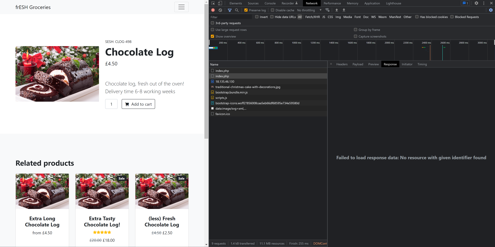

# Chocolate Log
> 200pts

## Briefing
Our SIEM shows some suspicious traffic originating from our new work in progress e-commerce site! It's only been online for a day - can you figure out who's hacked it?

## Solution
If we load the website and look at our network log, we can see `/index.php` is being loaded:



Visting `/index.php` gives us the following:

```
Hacker's Key Log Records!
Most recent keys data:

Most recent mouseclick data: 59,22)(694,147)(1047,205)

Hacker's secret flag: SESH{t4stY_ch0cOL4t£_keY_LOG!}

This page is protected by HTTP Authentication.
```

## Flag
Flag: `SESH{t4stY_ch0cOL4t£_keY_LOG!}` 