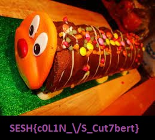

# A Strange Caterpillar Message
> 65pts

## Breifing
Our grocery shop is being sued by S&M for a Chris the Caterpillar lookalike, One of informants has sent us a file with a password inside apparently but they just sent us a picture of Chris. I wonder what it could mean...

## Solution
The provided file can be found [here](Our_Lovely_Cake.jpg).

Running `binwalk` on the file provides us with the following:

```console
alice@AC-LAPTOP:/mnt/c/Users/Alice/Downloads$ binwalk -e Our_Lovely_Cake.jpg

DECIMAL       HEXADECIMAL     DESCRIPTION
--------------------------------------------------------------------------------
0             0x0             JPEG image data, JFIF standard 1.01
30            0x1E            TIFF image data, little-endian offset of first image directory: 8
478757        0x74E25         Zip archive data, at least v2.0 to extract, compressed size: 24664, uncompressed size: 25801, name: Caterpillar Ception.jpg
503543        0x7AEF7         End of Zip archive, footer length: 22
```

This provides us with a [zip](74E25.zip) and [jpeg](Caterpillar%20Ception.jpg):


We can now change the dimensions on this image to get the flag:
```py
#!/usr/bin/env python

import struct
import argparse


def main():
    parser = argparse.ArgumentParser()

    parser.add_argument("image", help="The image to change the dimensions of.")
    parser.add_argument("changed_image", help="The file name to save the new image to.")
    parser.add_argument("--width", required=True, help="The new width of the image.", type=int)
    parser.add_argument("--height", required=True, help="The new height of the image.", type=int)

    args = parser.parse_args()

    with open(args.image, "rb") as f:
        imdata = f.read()

    new_shape = struct.pack(">HH", args.height, args.width)

    # start of frame marker (yes there are others, I'm lazy)
    if (sof := imdata.find(bytes([0xFF, 0xC0]))) is not None:
        imdata = imdata[:sof+5] + new_shape + imdata[sof+9:]

        with open(args.changed_image, "wb") as f:
            f.write(imdata)
    else:
        print("Couldn't find Start of frame marker.")


if __name__ == "__main__":
    main()
```



## Flag
Flag: ` `
